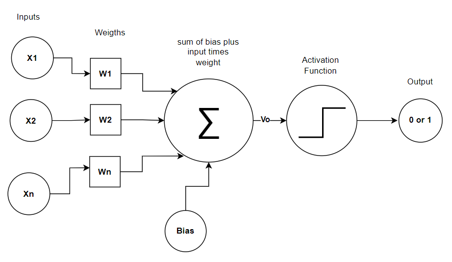

# ANN - Artificial Neural Network

#### Overview about Perceptron

<p align="jutify">
The objective of this project is to study the Artificial Neural Network using that Perceptron.
The figure below shows the structure of perceptron. The input values <b>(x, i=1,..., d)</b> with their weights <b>(w, i=1,...,d)</b> are combined with bias values <b>()</b> to result in induced field values. These values are scaled using activation function <b>(sigma or degree function)</b> to values 0 or 1.<br></br>
<b>[1] Equation of Neuron:</b>
$$\left(v_0 =\sum_{i=1}^d (x_i*w_i )+b_i\right)$$
The solution to this equation[1], also known as <b>induced field</b>, is processed by activation function as shown in the equation below [2].<br><br/>
<b>[2] Activation Function:</b>
$$y^0 = f(v_0)$$
Through a feedforward process, the calibration of new weights and bias can be realized and this results in the training of the network for predicting or learning the solution of the problem. After this calibration, the network is ready to identify solutions to problems such as AND, XOR or any problems that can be linearly separated. 
</p>

#### Structure of Perceptron



### To Build enviroment in Anaconda
 
```
conda create --name "name_env" 
conda info --envs
conda activate "nome_env"
conda deactivate
source ~/.bashrc               # init anaconda base
```

### Activate R:

```
conda activate r-environment
```

### Update R:

```
conda install -c conda-forge r-base=4.X.X
```

### Scripts:

```
source init.sh    # To initialization the enviroment
source stop.sh    # Deactivating the enviroment
source deploy.sh  # To initialization the deployment
```
### Install packages:

```
conda install -c conda-forge "name_package"
``` 
### To open jupyter notebook:
```
jupyter notebook --port=8889 --no-browser
```
### Build script Shell
```
chmod +x "name_script.sh"
```
